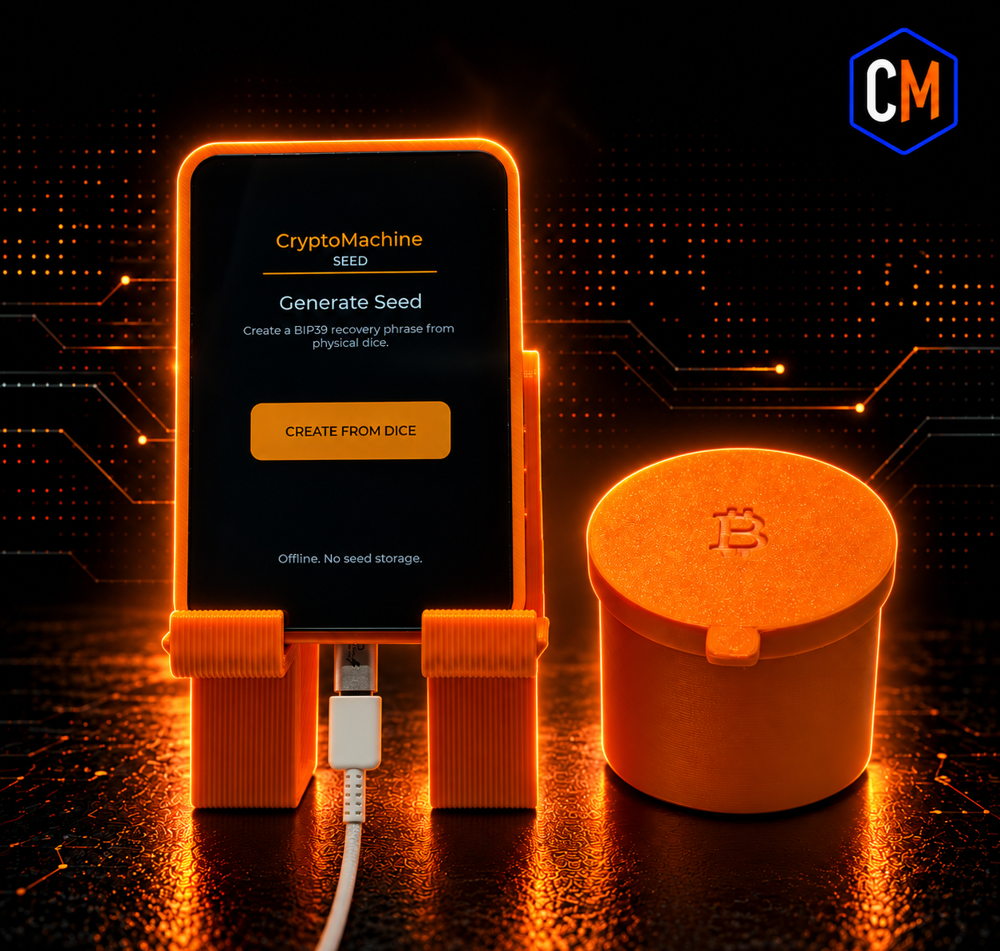
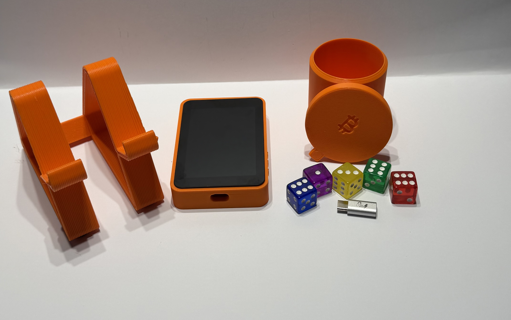

# CryptoMachine Seed

**Roll. Verify. Write. Destroy.**

  

CryptoMachine Seed is a dedicated offline BIP39 seed phrase generator that uses user-supplied physical dice entropy.

The device is designed to do one job well: guide a user through creating a 12-word or 24-word BIP39 recovery phrase from physical dice entropy, allow the generation process and result to be reviewed, and then clear the active ceremony.

> **Project status:** Production firmware `v1.0.0` released.  
> **Release tag:** `v1.0.0`  
> **Source commit:** `2482b530b5fe1063635e260eceaa9f6b9daa759a`  
> **Production UF2 SHA-256:** `CF8B726FC5CE1ED0482E131D595303D23A3C916681EFB837A6C84BD479658F4F`

## Why CryptoMachine Seed?

CryptoMachine Seed is built around a simple idea:

**The randomness starts with dice in your hands.**

Instead of relying on an online service, phone app, browser, cloud-connected device, or manually working through a printed list of 2,048 BIP39 words, CryptoMachine Seed guides the seed-generation ceremony locally on dedicated hardware.

The workflow is intentionally simple:

**Roll → Verify → Write → Destroy**

## V1 Features

CryptoMachine Seed v1.0.0 supports:

- 12-word BIP39 recovery phrases
- 24-word BIP39 recovery phrases
- Physical D6 dice as the entropy source
- 50 physical dice rolls for a 12-word phrase
- 100 physical dice rolls for a 24-word phrase
- Guided touchscreen dice entry
- Automatic BIP39 checksum generation
- Full mnemonic review
- Entropy Details
- Session destruction through **Finish & Destroy**
- Inactivity warning and automatic session destruction
- Manual BIP39 word-entry and checksum tooling
- Deterministic test vectors for independent verification

## Physical Dice Entropy

CryptoMachine Seed uses standard six-sided dice as the user-controlled entropy source.

For the normal five-dice workflow:

- **12-word mode:** 50 dice results, typically 10 shakes of five dice
- **24-word mode:** 100 dice results, typically 20 shakes of five dice

The dice results are entered directly on the touchscreen in the order shown.

For deterministic seed generation, the entered dice digits are processed as ASCII using SHA-256.

- For a **12-word phrase**, the first 128 bits of the SHA-256 digest are used as BIP39 entropy.
- For a **24-word phrase**, the full 256-bit SHA-256 digest is used as BIP39 entropy.

The required BIP39 checksum is then calculated automatically by the firmware.

The user does not choose or guess the checksum word during the dice ceremony.

## Entropy Details

CryptoMachine Seed includes an **Entropy Details** view so the seed-generation process does not have to be treated as a black box.

The project includes deterministic test vectors and independent verification instructions that allow the dice input, SHA-256 result, BIP39 entropy, checksum, and final mnemonic to be checked using separate software.

See:

- `TESTVECTORS.md`
- `VERIFY.md`

## Offline by Design

The reference hardware used by CryptoMachine Seed has no Wi-Fi or Bluetooth radio.

CryptoMachine Seed does not require:

- Wi-Fi
- Bluetooth
- A cloud account
- Analytics
- Telemetry
- Synchronization
- A wallet connection
- A network connection

Seed generation takes place locally on the device.

## No Intentional Seed Persistence

CryptoMachine Seed is designed around a temporary session model.

Dice input, derived entropy, mnemonic state, and other sensitive UI/session data are held only for the active ceremony and are not intentionally written to persistent storage.

When **Finish & Destroy** is selected, the active session is cleared and the device returns to a fresh state.

The inactivity protection built into v1.0.0 behaves as follows:

- After approximately 3 minutes of inactivity, the display dims.
- After approximately 9 minutes, a destruction warning and 60-second countdown are displayed.
- At approximately 10 minutes, the active sensitive session is automatically destroyed.

Production builds are configured with development logging disabled.

For detailed security assumptions, limitations, destruction boundaries, and threat-model information, see `SECURITY.md`.

## What CryptoMachine Seed Does Not Do

CryptoMachine Seed is intentionally narrow in scope.

It does not:

- Connect to your wallet
- Sign Bitcoin transactions
- Store a recovery phrase for later retrieval
- Upload your seed
- Require an account
- Require a cloud service
- Require a network connection

CryptoMachine Seed is a seed-generation appliance, not a hardware wallet.

## CryptoMachine Seed Hardware

  
  

The CryptoMachine Seed system combines the dedicated touchscreen device with the physical tools used during the dice-based seed-generation ceremony.

## Reference Hardware

Current reference hardware:

- Waveshare RP2350-Touch-LCD-3.5
- RP2350B
- 3.5-inch 320×480 capacitive touchscreen
- USB-C power
- Five physical D6 dice
- USB data blocker for power-only operation during normal use
- CryptoMachine Seed enclosure
- Purpose-built Seed stand
- Dice shaker cup with lid

CryptoMachine Seed includes a portable core separated from the RP2350-specific hardware and UI layer.

## Repository Layout

The project is organized so deterministic seed-generation logic can be tested independently from the hardware target.

- `firmware/core/` : portable dice, SHA-256, BIP39, ceremony, state-machine, secure-zero, and application logic
- `firmware/rp2350/` : RP2350 hardware, display, touch, LVGL UI, and device entry point
- `tests/` : host-side regression and deterministic testing
- `tools/` : production release and verification tooling
- `docs/` : additional project documentation and supporting material

## Testing and Verification

CryptoMachine Seed includes host-side regression tests for the portable core and production build verification for the RP2350 firmware.

The v1.0.0 production release completed:

- **14/14 host regression tests**
- Clean RP2350 production build
- Production release guard verification
- Development logging verification
- Firmware signing verification
- RP2350 ARM Secure image verification
- Firmware signature verification
- 4096-byte production main stack verification
- RP2350 stack-guard runtime verification
- First-party stack-usage analysis
- Development diagnostic symbol checks
- Development diagnostic string checks

The largest first-party static stack frame measured during release verification was 728 bytes against a 1024-byte release limit.

## Hardware Acceptance

The exact UF2 published for v1.0.0 completed hardware acceptance testing on known-good CryptoMachine Seed hardware.

Acceptance testing included:

- Clean boot to the Home screen
- Touchscreen operation
- 12-word deterministic test vector
- 24-word deterministic test vector
- Entropy Details
- Return from Entropy Details to mnemonic review
- Finish & Destroy
- Inactivity warning
- Automatic inactivity destruction
- Cold boot after a completed ceremony
- Confirmation that prior session material is not displayed after reboot
- Navigation, back, cancel, and repeated-tap abuse testing
- Dice-pattern warning behavior

The dice-pattern warning is informational only. It does not alter the entered dice sequence, entropy, checksum, or generated mnemonic.

## v1.0.0 Production Release

The first production firmware release is:

**Version**

`v1.0.0`

**Source commit**

`2482b530b5fe1063635e260eceaa9f6b9daa759a`

**Firmware**

`cryptomachine_seed.uf2`

**SHA-256**

`CF8B726FC5CE1ED0482E131D595303D23A3C916681EFB837A6C84BD479658F4F`

A matching `SHA256SUMS.txt` file is included with the GitHub release.

Always verify the SHA-256 of a downloaded UF2 before flashing it.

## Independent Verification

Do not rely only on CryptoMachine Seed itself to prove CryptoMachine Seed is correct.

This repository includes deterministic test vectors and instructions for independently reproducing BIP39 results.

See:

- `TESTVECTORS.md`
- `VERIFY.md`
- `SECURITY.md`
- `BUILD.md`
- `RELEASE.md`

**Never enter a real recovery phrase into an internet-connected website for verification.**

Use test data and offline verification tools.

## Production Release Security

Production signing private keys and other private release material are **not stored in this repository**.

The v1.0.0 production firmware was built with hardened release settings including:

- Production release guard enabled
- Development logging disabled
- Firmware signing enabled
- First-party stack-usage analysis enabled

The released UF2 is cryptographically signed and its signature is verified by the production release-verification tooling.

Firmware signing and RP2350 OTP secure-boot enforcement are separate controls.

A signed UF2 should not be interpreted as proof that irreversible RP2350 OTP secure-boot enforcement has been provisioned on a particular device.

See `SECURITY.md` and `RELEASE.md` for additional details.

## Build and Release Documentation

The repository includes:

- `BUILD.md` : known-working development build environment and build instructions
- `RELEASE.md` : production release procedure
- `VERIFY.md` : independent verification procedure
- `TESTVECTORS.md` : deterministic 12-word and 24-word test vectors
- `SECURITY.md` : security model, assumptions, limitations, and release-hardening information

## License and Branding

CryptoMachine Seed firmware is licensed under the **GNU General Public License version 3.0 (GPLv3)**.

See `LICENSE` for the complete software license.

The GPLv3 license applies to the software source code.

**CryptoMachine**, **CryptoMachine Seed**, associated logos, product artwork, packaging, and identifiers implying official CryptoMachine origin are not granted under the GPLv3.

Forks and modified versions must not imply that they are official CryptoMachine products.

See `TRADEMARK.md` for the project branding policy.

## Safety

A BIP39 recovery phrase can control access to Bitcoin funds.

Treat every real recovery phrase as highly sensitive.

Do not photograph it, email it, text it, upload it, or enter it into an internet-connected device unless you fully understand the security implications.

When testing or independently verifying CryptoMachine Seed, use test seeds.

---

**CryptoMachine Seed**  
**Roll. Verify. Write. Destroy.**

https://cryptomachine.shop/product/cryptomachine-seed/
